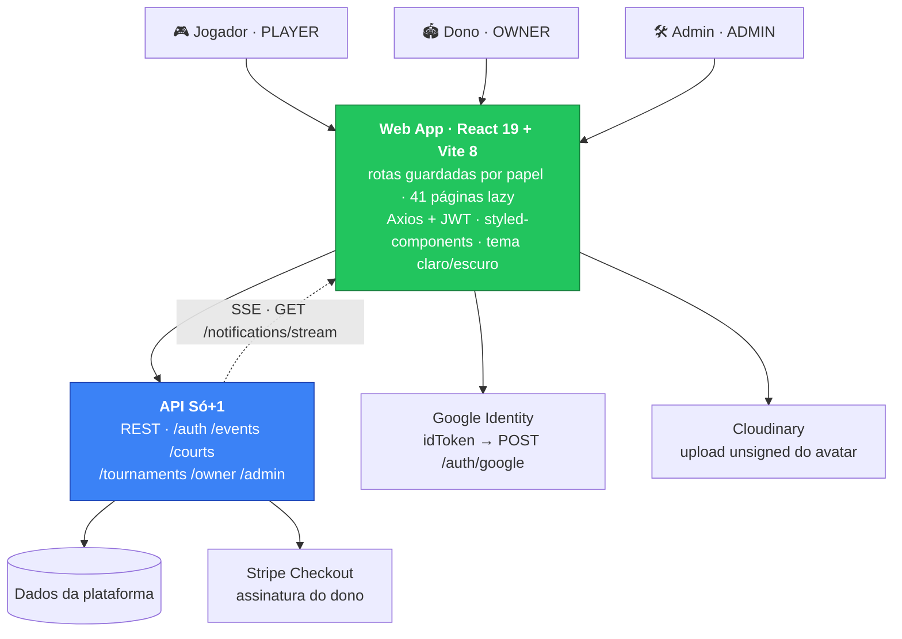

<div align="center">

# ⚽ Só+1 — Web App

### Encontre partidas abertas, entre com um clique e sorteie os times na hora.

**SaaS para organizar futebol amador** — do rachão da várzea ao torneio, sem grupo de WhatsApp. Web app para **jogadores, donos de quadra e admins**, com notificações em tempo real e reputação entre jogadores.

<p>
  <a href="https://app.so-mais-um.com"></a>
  <a href="https://so-mais-um.com"></a>
</p>

<p>
  
  
  
  
  
  
</p>

<sub>🟢 <strong>Em produção</strong> &nbsp;•&nbsp; 👥 <strong>3</strong> perfis de acesso &nbsp;•&nbsp; 🏅 <strong>12</strong> modalidades &nbsp;•&nbsp; 🔔 tempo real (SSE)</sub>

<br/><br/>


</div>

---

## 💡 O produto

Organizar partida hoje é um grupo de WhatsApp com 60 pessoas e nenhuma certeza. Quem confirmou? Sobrou vaga? Quanto dá por cabeça? Os times saem no par ou ímpar e, no domingo seguinte, ninguém lembra quem furou. O **Só+1** transforma isso em produto: a partida vira um evento com vagas contadas, valor rateado, times sorteados pelo servidor, presença confirmada e avaliação no fim — e a quadra vazia da terça-feira vira reserva.

O ciclo é **descobrir → entrar → jogar → avaliar**, e ele fecha em cima de três lados do mesmo mercado:

<table>
  <thead>
    <tr><th>Perfil</th><th>O que faz no app</th></tr>
  </thead>
  <tbody>
    <tr>
      <td>🎮 <strong>Jogador</strong><br/><code>PLAYER</code></td>
      <td>Busca partidas abertas com filtro por modalidade, cidade, horário, arena, preço por pessoa e vagas restantes. Entra com um clique, cria a própria partida num wizard de 3 etapas (quadra → detalhes → confirmação), copia a chave PIX do rateio, dispara o sorteio de times, marca presença e avalia quem jogou. Na mesma busca ele vê os <strong>day uses</strong> acontecendo — o dia avulso de valor fixo, em que não se combina nada: chega, paga no local e joga.</td>
    </tr>
    <tr>
      <td>🏟️ <strong>Dono de quadra</strong><br/><code>OWNER</code></td>
      <td>Pede o cadastro do espaço, gerencia locais e quadras (criar, editar, ativar/desativar), acompanha as solicitações e assina o <strong>Só+1 Pro</strong> — sem assinatura em dia ele continua consultando tudo, e só as ações que gravam ficam desabilitadas, como a API já fazia.<br/><br/>O pagamento tem <strong>dois caminhos, e a tela mostra os dois</strong>: no <strong>cartão</strong>, o valor sobe para cobrir a taxa que a Stripe retém — o preço do plano é o que a plataforma recebe, não o que o cliente paga; no <strong>Pix</strong>, que cai inteiro, ele desce de volta e vira <strong>5% de desconto</strong>, combinado no WhatsApp e confirmado em até 24h por quem recebe.<br/><br/>Vende a quadra de três jeitos, e cada um tem a sua tela: a <strong>partida</strong> que alguém marca e rateia, a <strong>turma</strong> semanal com matrícula, chamada e mensalidade, e o <strong>day use</strong> — cria o dia, e a lista diz quem entrou, por qual faixa e quem já pagou.</td>
    </tr>
    <tr>
      <td>🛠️ <strong>Admin</strong><br/><code>ADMIN</code></td>
      <td>Modera a plataforma: aprova ou rejeita solicitações de espaço com justificativa, promove/rebaixa usuários entre <code>PLAYER</code> e <code>OWNER</code>, vincula donos a locais e convida parceiros por link. O admin também entra em qualquer painel de dono.<br/><br/>Enquanto não há gateway, é ele quem <strong>registra a assinatura paga por fora</strong>: o Pix é combinado no WhatsApp, e a tela de assinaturas grava que o dinheiro chegou — com a validade, que é o que vence a assinatura manual, e o nome de quem registrou. A cobrada pela Stripe aparece na mesma lista e não se deixa editar, com o motivo à vista.</td>
    </tr>
  </tbody>
</table>

São **43 rotas** sobre **41 páginas carregadas sob demanda**, **12 modalidades** (de futsal a beach tennis), reputação com **6 tags** de comportamento (Craque da Partida, Pontual, Fair Play…) e torneios com divisões em **5 níveis** — tudo consumindo a API do Só+1 via REST, com um canal SSE aberto para as notificações.



---

## ✨ Destaques de engenharia

**Deploy novo não quebra a aba que já estava aberta.** SPA com code splitting tem um problema clássico: você publica, o hash dos chunks muda, e o usuário que estava com a página aberta clica num link e recebe um 404 de módulo. Aqui a defesa tem duas camadas. `lazyWithRetry` embrulha cada `import()` e, se o chunk sumiu, recarrega a página em vez de estourar. O que escapar cai no `ErrorBoundary`, que reconhece a assinatura do erro (`Failed to fetch dynamically imported module`, `Unable to preload CSS`) e recarrega também — só mostra a tela de erro para falhas de verdade. O `vercel.json` fecha o combo: `index.html` com `no-store`, `/assets/*` com `immutable` por um ano.

**SSE autenticado por cookie.** O sino de notificações escuta `GET /notifications/stream` via `EventSource` — sem polling, sem WebSocket para manter de pé. `EventSource` não deixa mandar header `Authorization`, e era por isso que o JWT ia na query string; agora vai o cookie de sessão, com `withCredentials: true`, e a conexão é fechada no cleanup do efeito. Cada notificação nova entra no topo da lista sem refetch, e payload malformado é ignorado em silêncio: o sino é acessório, nunca derruba a tela.

**Filtro híbrido: rede onde importa, memória onde é barato.** `courtType` e `city` são filtros server-side — mudaram, refaz o fetch paginado do zero (`limit: 20`, `hasMore` para o "carregar mais"). Busca textual, faixa de horário, preço por pessoa, arena e "só com vaga" filtram em memória sobre o que já veio. Resultado: nenhuma requisição a cada tecla digitada, e a lista de cidades e arenas dos selects é derivada dos próprios resultados com `useMemo`, em vez de exigir um endpoint só para popular dropdown.

**A sessão não é legível por JavaScript.** O token não mora mais no `localStorage`: ele vem em cookie `httpOnly` emitido pela API, que este código não lê nem escreve — um XSS na página deixa de valer a sessão inteira. O que sobra no `localStorage` é a marca `só+1:sessao`, que **não é credencial**: ela só diz se vale a pena perguntar `GET /auth/me` ao montar, e forjá-la à mão rende um 401. O `AuthContext` valida essa marca contra o `/auth/me` no mount e segura o render das rotas com um `loading` — sem isso, um refresh na `/admin` piscaria a tela de login antes de reconhecer o usuário. Dois interceptors Axios cuidam do resto: o de request manda `X-Requested-With` no que muda estado (é a defesa contra CSRF que a API exige), o de response trata `401` como veredito final — esquece a sessão e manda para `/login`, mas só de quem tinha sessão, para não arrancar um visitante do `/redefinir-senha?token=...`. Não há refresh token no front: o 401 desloga, ponto.

**Quatro guardas de rota, não um `isAdmin` espalhado.** `PublicRoute` (logado não vê login e é despachado para o painel do seu papel), `PrivateRoute`, `AdminRoute` e `OwnerRoute` — que deixa `ADMIN` passar por dentro, porque admin precisa enxergar o que o dono enxerga. A autorização vive no roteador, num arquivo só; as páginas não conhecem papel.

**Fallback local para o catálogo de modalidades.** `useSports` busca as modalidades da API e, se ela não responder, cai para uma lista embutida de 12 esportes agrupados em tabs. A tela de filtros nunca aparece vazia por causa de um GET que falhou. O mesmo princípio no upload de avatar: sem Cloudinary configurado, `cloudinaryReady` some com o botão em vez de oferecer um recurso que vai quebrar.

**Assinatura vencida esconde o botão, não o dado.** No painel do dono a regra é uma só, e é a do servidor: **leitura é livre, escrita exige assinatura em dia** — na API o `requireActiveSubscription` está nos `POST`/`PATCH`/`DELETE` e nunca nos `GET`. Na tela, quem responde por isso é o `podeAlterar` do `useSubscription`, que desabilita cada ação que grava; o `SubscriptionGate` só avisa, numa faixa acima do conteúdo. Até a #244 as cinco telas do painel não concordavam: quatro apagavam tudo a 25% sob um cartão de "Assinatura necessária" — carregando os dados para depois escondê-los — e o Estoque deixava consultar e travava só a edição. Quem navegava pelo menu via o produto mudar de regra a cada clique. **O dono com pagamento atrasado é justamente quem mais precisa enxergar o próprio negócio**, para conferir o que tem e decidir se renova. A única situação em que o clique ainda é segurado é enquanto o status não chegou: liberar ali é o beco em que se preenchia o formulário inteiro para levar 402 no fim.

**Tema que começa certo.** O `ThemeContext` lê `prefers-color-scheme` na primeira visita e persiste a escolha no `localStorage`; o `ThemeProvider` do styled-components troca o objeto de tokens inteiro (cores, spacing, fontes) e o `Toaster` do sonner acompanha. Sem flash de tema errado, sem classe `dark` pendurada no `<body>`.

---

## 📸 Telas

<div align="center">

**Descubra partidas abertas perto de você e entre com um clique**


</div>

|  Quero Jogar  |  Criar Partida  |
| :-----------: | :------------: |
|  |  |
| **Minhas Partidas** | **Histórico** |
|  |  |

<details>
<summary><strong>Mais telas</strong> — torneios, avaliações, perfil e login</summary>

<br/>

|  Torneios  |  Avaliações  |
| :--------: | :----------: |
|  |  |
| **Perfil** | **Login** |
|  |  |

</details>

---

## 🛠️ Stack

<table>
  <tbody>
    <tr>
      <td><strong>UI</strong></td>
      <td>   </td>
    </tr>
    <tr>
      <td><strong>Rotas</strong></td>
      <td> — <code>lazy</code> + <code>Suspense</code>, guardas por papel</td>
    </tr>
    <tr>
      <td><strong>Formulários</strong></td>
      <td>  via <code>@hookform/resolvers</code></td>
    </tr>
    <tr>
      <td><strong>Dados / Auth</strong></td>
      <td> (interceptors JWT)  <code>@react-oauth/google</code></td>
    </tr>
    <tr>
      <td><strong>Tempo real</strong></td>
      <td> — sino de notificações</td>
    </tr>
    <tr>
      <td><strong>Mapa</strong></td>
      <td>  + tiles OpenStreetMap — componente com agrupamento por coordenada e auto-fit de bounds, ainda fora das rotas. A localização em produção sai por deep link do Google Maps.</td>
    </tr>
    <tr>
      <td><strong>Mídia / Animação</strong></td>
      <td> (upload unsigned)  (abertura)  (toasts)</td>
    </tr>
    <tr>
      <td><strong>Qualidade</strong></td>
      <td>     — lint + typecheck + teste + build a cada push e PR em <code>main</code> e <code>develop</code></td>
    </tr>
    <tr>
      <td><strong>Deploy</strong></td>
      <td> — preview por PR, produção a partir de <code>main</code> (<code>vercel build --prod</code> no CI)</td>
    </tr>
  </tbody>
</table>

---

## 🚀 Rodando localmente

### 1. Pré-requisitos

| Requisito | Versão | Observação |
|---|---|---|
| **Node.js** | **24.x** | Versão usada no CI (`.github/workflows/ci-cd.yml`). Vite 8 exige Node 20.19+ / 22.12+. |
| **npm** | 10+ | Acompanha o Node 24. |
| **API do Só+1** | — | O front não tem mock: sem API, as telas autenticadas ficam vazias. Suba a API (repositório privado) ou aponte para produção (passo 4). |
| Google Cloud Console | — | Opcional. Só para testar o botão "Entrar com Google". |
| Conta Cloudinary | — | Opcional. Só para testar o upload de avatar. |

### 2. Clone e instale

```bash
git clone https://github.com/mateus-vitor-ferreira-dev/so-mais-um-web.git
cd so-mais-um-web

npm install
```

### 3. Configure o ambiente

```bash
cp .env.example .env
```

O arquivo `.env` completo — todas as variáveis lidas por `src/config/env.js`:

```ini
# ── API ─────────────────────────────────────────────────────────────
# Base de todas as chamadas Axios e do stream SSE de notificações.
# Opcional: sem ela, o código cai no default http://localhost:3000.
VITE_API_URL=http://localhost:3000

# ── Google OAuth ────────────────────────────────────────────────────
# Client ID OAuth 2.0 do tipo "Aplicativo da Web".
# Como obter: Google Cloud Console → APIs e Serviços → Credenciais →
#   Criar credenciais → ID do cliente OAuth → Aplicativo da Web.
#   Em "Origens JavaScript autorizadas", adicione http://localhost:5173
# Opcional em dev: sem ela o app sobe (usa 'not-configured') e o login
#   por e-mail/senha funciona normalmente — só o botão do Google quebra.
VITE_GOOGLE_CLIENT_ID=seu-client-id.apps.googleusercontent.com

# ── Cloudinary (upload do avatar) ───────────────────────────────────
# Cloud name: painel do Cloudinary → Dashboard (canto superior esquerdo).
# Upload preset: Settings → Upload → Upload presets → Add upload preset,
#   com Signing Mode = Unsigned (o upload vai direto do browser).
# Opcional: sem as duas, o botão de trocar foto some da tela de Perfil
#   (flag `cloudinaryReady`) em vez de falhar no clique.
VITE_CLOUDINARY_CLOUD_NAME=seu-cloud-name
VITE_CLOUDINARY_UPLOAD_PRESET=seu-upload-preset-unsigned

# ── Stripe ──────────────────────────────────────────────────────────
# Chave publicável (pk_test_... / pk_live_...) — Stripe Dashboard →
#   Developers → API keys.
# Opcional: hoje é apenas exposta por src/config/env.js. O checkout da
#   assinatura é criado pela API (POST /owner/subscription/checkout) e o
#   front só redireciona para a URL devolvida — não há Stripe.js no bundle.
VITE_STRIPE_PUBLISHABLE_KEY=
```

> ⚠️ Só variáveis com o prefixo `VITE_` chegam ao browser — e **tudo que chega ao browser é público**. Nunca coloque secret key, token de API ou senha aqui. Nunca commite `.env`.

### 4. API local ou produção?

O único ponteiro é `VITE_API_URL`:

```ini
# Apontando para a API rodando na sua máquina (default do .env.example)
VITE_API_URL=http://localhost:3000

# Apontando para a API de produção — útil para mexer só na UI
VITE_API_URL=https://api.so-mais-um.com
```

Trocar exige **reiniciar o `npm run dev`**: o Vite injeta `import.meta.env` em build/dev-server start, não em runtime. O deploy não usa `.env` — a Vercel e o workflow de CI injetam `VITE_API_URL` e `VITE_GOOGLE_CLIENT_ID` na hora do build (veja `.env.production` e `ci-cd.yml`).

### 5. Suba o app

```bash
npm run dev
```

| Endpoint | URL |
|---|---|
| Web app | `http://localhost:5173` (porta padrão do Vite) |
| API (default local) | `http://localhost:3000` |
| Stream de notificações | `http://localhost:3000/notifications/stream` |
| Build de produção servido localmente | `http://localhost:4173` (`npm run preview`) |

### 6. Como saber que subiu

1. Abra `http://localhost:5173` — cai na animação de abertura e segue para `/login`.
2. Crie uma conta em `/register`. Se voltar para `/home` com seu nome no topo, o front está falando com a API: `POST /auth/register` devolveu o cookie de sessão e o `AuthContext` já revalidou com `GET /auth/me`. No DevTools, o cookie aparece marcado `HttpOnly` e o `localStorage` tem só a marca `só+1:sessao`.
3. Recarregue a página. Continuar logado prova que a restauração de sessão funciona.
4. No DevTools → Network → filtro `EventSource`, a conexão com `/notifications/stream` deve aparecer aberta (status `pending`) — é o SSE do sino.

### 7. Problemas comuns

<table>
  <tbody>
    <tr>
      <td><strong>Toda chamada volta erro de CORS</strong></td>
      <td>A API precisa liberar a origem <code>http://localhost:5173</code>. Confira a config de CORS da API — não é ajustável pelo front.</td>
    </tr>
    <tr>
      <td><strong>Loop infinito para <code>/login</code></strong></td>
      <td>O interceptor de response derruba a sessão em qualquer <code>401</code>. Normalmente é sessão expirada ou <code>VITE_API_URL</code> apontando para uma API com outro <code>JWT_SECRET</code>. Apague o cookie <code>somaisum_sessao</code> pelo DevTools, limpe a marca <code>só+1:sessao</code> no <code>localStorage</code> e refaça o login.</td>
    </tr>
    <tr>
      <td><strong>Botão do Google não abre nada</strong></td>
      <td><code>VITE_GOOGLE_CLIENT_ID</code> ausente (o app cai em <code>'not-configured'</code>) ou <code>http://localhost:5173</code> não está nas origens autorizadas do OAuth client.</td>
    </tr>
    <tr>
      <td><strong>Mudei o <code>.env</code> e nada mudou</strong></td>
      <td>Reinicie o dev server. O Vite lê o <code>.env</code> no start; HMR não recarrega variável de ambiente.</td>
    </tr>
    <tr>
      <td><strong>Porta 5173 ocupada</strong></td>
      <td>O Vite sobe na próxima livre (5174…). Se precisar fixar: <code>npm run dev -- --port 3001</code> — e lembre de liberar essa origem no CORS da API e no Google OAuth.</td>
    </tr>
    <tr>
      <td><strong>Botão de trocar foto sumiu do Perfil</strong></td>
      <td>Comportamento esperado: as duas variáveis do Cloudinary não estão configuradas.</td>
    </tr>
    <tr>
      <td><strong>Rota funciona em dev e dá 404 em servidor próprio</strong></td>
      <td>É uma SPA — todo caminho tem que servir o <code>index.html</code>. Na Vercel isso vem do rewrite em <code>vercel.json</code>; em outro host, replique a regra.</td>
    </tr>
  </tbody>
</table>

### 8. Scripts

| Script | O que faz |
|---|---|
| `npm run dev` | Dev server do Vite com HMR em `http://localhost:5173` |
| `npm run build` | Build de produção em `dist/` |
| `npm run preview` | Serve o `dist/` em `http://localhost:4173` — use para reproduzir bug que só aparece em build |
| `npm run lint` | ESLint 10 (flat config) + typescript-eslint em todo o projeto, `.js` e `.ts`/`.tsx` |
| `npm run typecheck` | `tsc --noEmit` — checa os tipos sem gerar arquivo |
| `npm test` | Roda a suíte uma vez e sai — é o que o CI executa |
| `npm run test:watch` | Modo interativo: reexecuta só o que você mexeu. É o que você usa escrevendo teste |
| `npm run test:coverage` | Suíte + relatório de cobertura no terminal e em `coverage/index.html` |
| `npm run readme:check` | Confere contra a suíte os números que este README anuncia |
| `npm run readme:fix` | Reescreve esses números — eles são gerados, não digitados |
| `npm run primeira-tela:check` | Confere que a raiz sem sessão não carrega componente de rota autenticada |

> O CI roda, nesta ordem, `lint` → `typecheck` → `test:ci` → `readme:check` → `primeira-tela:check` → `build`. Qualquer um vermelho barra o merge.

---

## 🧪 Testes

**Vitest + Testing Library + jsdom.** O Vitest reaproveita o `vite.config.ts`, então o teste enxerga exatamente as mesmas resoluções de import e plugins que o app — não existe um segundo build para manter em pé.

### Onde o teste mora

Ao lado do código que ele testa, com sufixo `.test.ts` / `.test.tsx`:

```
src/utils/masks.ts                    →  src/utils/masks.test.ts
src/components/RoleBadge/index.tsx    →  src/components/RoleBadge/index.test.tsx
```

Nada de pasta `__tests__` separada: teste longe do código é teste que ninguém lembra de atualizar quando o componente muda.

| Arquivo | Para quê |
|---|---|
| `src/test/setup.ts` | Roda antes de cada arquivo de teste: matchers do jest-dom, stub de `matchMedia` e limpeza de DOM + `localStorage` |
| `src/test/render.tsx` | O helper `renderWithProviders` e o reexport da Testing Library |
| `src/test/render.test.tsx` | O teste do próprio helper — helper quebrado falha no teste de quem só estava usando ele |
| `src/test/factories.ts` | Fábricas de `Partida`, `UserMe` e afins. Passe só o que o teste afirma: `criaPartida({ maxPlayers: 10 })` |

### O padrão

Componente do Só+1 quase nunca renderiza sozinho — ele depende de tema, rota ou sessão. Por isso **use sempre `renderWithProviders`**, que monta a mesma pilha de providers do `App.tsx` (Google OAuth → tema → rota → auth):

```tsx
import { describe, it, expect } from 'vitest'
import { renderWithProviders, screen } from '../../test/render'
import RoleBadge from './index'

describe('<RoleBadge />', () => {
  it('mostra "Admin" para o papel ADMIN', () => {
    renderWithProviders(<RoleBadge role="ADMIN" />)
    expect(screen.getByText('Admin')).toBeInTheDocument()
  })
})
```

Ele devolve junto uma instância de `user-event` já configurada, e aceita `route`, `path` e `theme`:

```tsx
const { user } = renderWithProviders(<PartidaDetail />, {
  route: '/partida/42',        // onde o MemoryRouter começa
  path:  '/partida/:eventId',  // padrão da rota — é o que faz useParams funcionar
  theme: 'dark',
})
await user.click(screen.getByRole('button', { name: /entrar na partida/i }))
expect(await screen.findByText(/você está dentro/i)).toBeInTheDocument()
```

> **Componente que lê `useParams` precisa dos dois.** Só `route` coloca a URL no lugar, mas quem extrai `:eventId` é o casamento com o `path` — sem ele, `useParams()` volta `{}` e o componente quebra num erro que não parece ter relação nenhuma com rota.

### Cinco regras que o time segue

1. **Consulte a tela como o usuário consulta.** `getByRole` e `getByText` primeiro; `getByTestId` é último recurso, não atalho. Teste que procura classe do styled-components quebra no próximo refactor sem que nada tenha parado de funcionar.
2. **Descreva comportamento, não implementação.** `it('mostra "Admin" para o papel ADMIN')` — não `it('renderiza o Badge com ROLE_MAP')`.
3. **`user-event` em vez de `fireEvent`.** Ele dispara a sequência real do navegador e já envolve tudo em `act`. É sempre `await`.
4. **Nada de rede no teste.** Mocke o módulo de serviço com `vi.mock('../../services/events')` — o teste não pode depender da API estar de pé.
5. **Espere com `findBy*` / `waitFor`, nunca com `setTimeout`.** Teste que dorme é teste que fica lento e falha sozinho no CI.

### Import só de `src/test/render`

`renderWithProviders`, `screen`, `waitFor`, `within` — tudo sai do mesmo lugar, porque `src/test/render.tsx` reexporta a Testing Library inteira:

```tsx
import { renderWithProviders, screen, waitFor } from '../../test/render'
```

### O que já está coberto

Os fluxos críticos do jogador, o que dá mais prejuízo quando quebra:

| Fluxo | Onde | O que garante |
|---|---|---|
| Login e sessão | `contexts/AuthContext.test.tsx` | Restaura a sessão ao montar, descarta sessão expirada, marca e limpa no login/logout, e sai mesmo se a chamada de logout falhar |
| Sessão expirada | `services/api.test.ts` | No 401 o interceptor desloga e manda para `/login` — e **não** desloga em 403 ou 500 |
| Entrar na conta | `pages/Register/index.test.tsx` | Validação, mensagem da API na tela, e o destino certo por papel (jogador, dono, admin) |
| Buscar partida | `pages/QueroJogar/index.test.tsx` | Filtro de modalidade e cidade refaz a busca na API; horário, arena e texto recortam sem nova ida |
| Entrar na partida | `pages/PartidaDetail/index.test.tsx` | Contagem de vagas, botão bloqueado quando lotado ou já confirmado, Pix só para quem está dentro |
| Sair da partida | `pages/PartidaDetail/index.test.tsx` | Quem pode sair, confirmação obrigatória, motivo opcional e a vaga voltando na tela |
| Criar partida | `pages/CriarPartida/index.test.tsx` | Validação dos quatro campos, conversão do payload e erro da API renderizado |
| Minhas partidas | `pages/MinhasPartidas/index.test.tsx` | As duas abas com formatos de resposta diferentes, ações do organizador por status e sorteio de times |
| Contrato com a API | `services/playerService.test.ts` | Método, caminho e onde cada coisa vai — inclusive o corpo do `DELETE`, que no axios não é o segundo argumento |
| Mensagem de erro | `utils/apiError.test.ts` | O que o usuário lê quando algo falha, para qualquer coisa que caia no `catch` |
| Catálogo de modalidades | `hooks/useSports.test.tsx` | O fallback local que sustenta busca, cadastro e criação quando a API não responde |
| Gate de assinatura | `hooks/useSubscription.test.tsx` · `utils/toastErro.test.ts` | O `isActive` concordando com o middleware da API, inclusive na tolerância de `past_due`, e o erro 402 mostrando o caminho do pagamento |
| Assinatura vencida no painel | `pages/Owner/{Places,Courts,Equipment,Requests,Inventory}/index.test.tsx` | As cinco telas se comportando igual: conteúdo consultável, ações que gravam desabilitadas e ninguém gravando antes de o status chegar |

**1019 testes, ~9s.** A cobertura de linhas está em **~70%**, e o número não é meta: o critério é cobrir o que dói quando quebra, não perseguir porcentagem. **Todo PR novo entra com teste do comportamento que ele muda** — é o que a [Definition of Done](https://github.com/mateus-vitor-ferreira-dev/so-mais-um-api/blob/main/docs/EQUIPE.md) pede.

---

## 🧭 Como a equipe trabalha

Áreas e responsabilidades, ritmo de sprint, fluxo de issue até deploy, Definition of Ready e Definition of Done: **[manual da equipe](https://github.com/mateus-vitor-ferreira-dev/so-mais-um-api/blob/main/docs/EQUIPE.md)** — vale para os três repositórios do Só+1.

---

<div align="center">
<sub><strong>Só+1</strong> · <a href="https://app.so-mais-um.com">app</a> · <a href="https://so-mais-um.com">landing</a> · <a href="https://github.com/mateus-vitor-ferreira-dev/so-mais-um-landing">repo da landing</a></sub>
</div>
